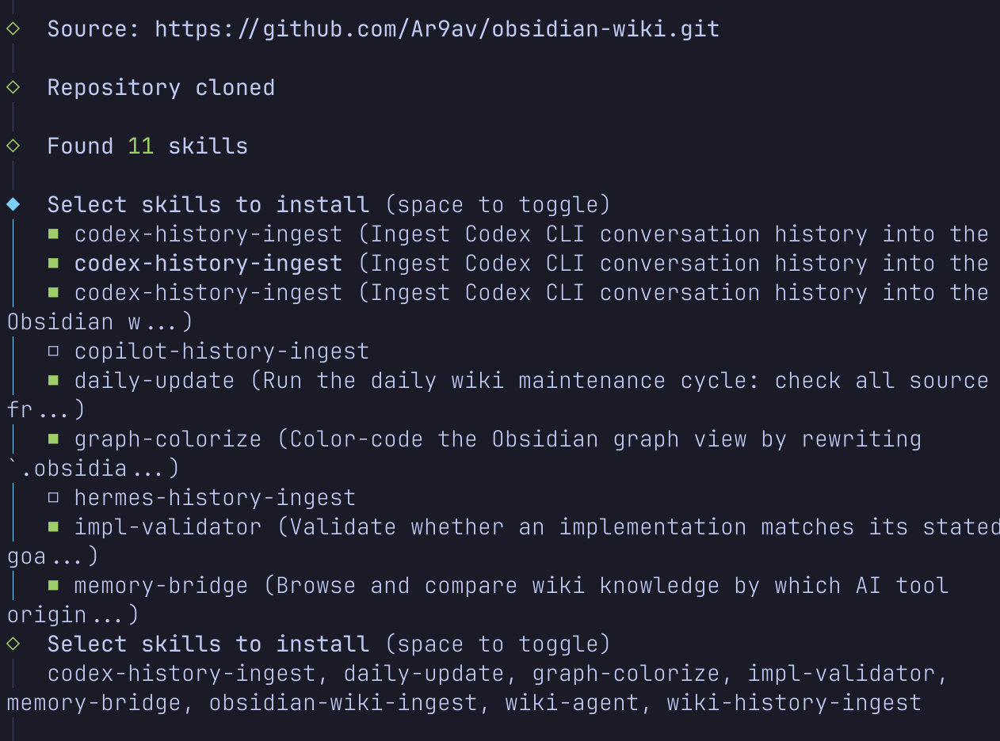

# LLM Wiki — Obsidian 知识库 Skills

[obsidian-wiki](https://github.com/Ar9av/obsidian-wiki) 是一套把 Obsidian 仓库变成"个人知识库"的 Skills 合集，思路来自 Karpathy 的 LLM Wiki：把你在和 AI 协作中沉淀的知识编译成互相链接的 Markdown，而不是每次都重新问一遍大模型。

主要能力：

- **知识沉淀**：把对话、文档、代码仓库提炼成 wiki 页面
- **历史导入**：导入 Codex / Copilot 等工具的对话历史
- **知识检索**：带 `[[wikilink]]` 引用的查询、周报、主题简报
- **图谱维护**：链接检查、去重、Obsidian 图谱着色

## 安装

官方推荐方式：

```bash
pip install obsidian-wiki
obsidian-wiki setup --vault ~/brain
```

也可以通过 Skills CLI 交互式安装（按需挑选要装的 Skills）：

```bash
npx skills add Ar9av/obsidian-wiki
```

## 安装注意事项

交互式安装会列出仓库中找到的所有 Skills，进入多选界面。

> **注意**：在选择界面中，**必须按空格键才是真正的选中**（仅高亮不算选中）。后面指定安装位置的步骤也是一样。



安装完成后，在 Agent 中直接说 "set up my wiki" 即可开始初始化自己的知识库。

## 相关资源

- [obsidian-wiki GitHub](https://github.com/Ar9av/obsidian-wiki)
- [Obsidian 官网](https://obsidian.md/)
