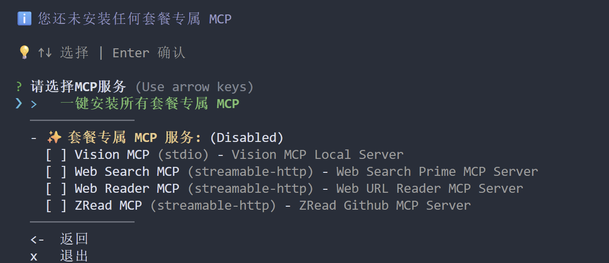

# MCP 配置 — 智谱套餐专属扩展

MCP（Model Context Protocol，模型上下文协议）是一种让 AI 模型与外部工具交互的协议。通过配置 MCP 服务器，可以为 Claude Code 添加图像理解、网页搜索、文档读取等扩展能力。

## 什么是 MCP？

MCP 是 Anthropic 推出的开放协议，用于连接 AI 模型与外部数据源和工具。它采用客户端-服务器架构：

- **MCP 客户端**：如 Claude Code、Cline、OpenCode 等编码工具
- **MCP 服务器**：提供特定功能的服务，如视觉理解、联网搜索等

通过 MCP，模型可以根据用户的提示自动调用最匹配的工具，在特定任务中获得更精准的效果。

## 智谱套餐专属 MCP

智谱 GLM Coding Plan 套餐提供了多个专属 MCP 服务器，通过配置助手可以一键安装全部套餐专属的 MCP：

- **视觉理解 MCP**（`@z_ai/mcp-server`）：图像、视频理解能力
- **联网搜索 MCP**（`web-search-prime`）：网络搜索能力
- **网页读取 MCP**（`web-reader`）：网页内容提取能力
- **GitHub 仓库读取 MCP**（`zread`）：读取 GitHub 仓库结构和文件

安装完成后，使用 `/status` 命令可以看到已连接的 MCP 服务器列表，每个服务器后面有 `✓` 标记表示连接成功。

## 视觉理解 MCP

视觉理解 MCP 服务器为模型添加了「眼睛」，使其能够理解和分析图像、视频内容。

### 功能特性

该服务器提供以下工具：

| 工具名称 | 功能说明 |
|---------|---------|
| `ui_to_artifact` | 将 UI 截图转换为代码、提示词、设计规范或自然语言描述 |
| `extract_text_from_screenshot` | 使用 OCR 从截图中提取文字，适用于代码、终端输出、文档等 |
| `diagnose_error_screenshot` | 解析错误弹窗、堆栈和日志截图，给出定位与修复建议 |
| `understand_technical_diagram` | 解读架构图、流程图、UML、ER 图等技术图纸 |
| `analyze_data_visualization` | 阅读仪表盘、统计图表，提炼趋势、异常与业务要点 |
| `ui_diff_check` | 对比两张 UI 截图，识别视觉差异和实现偏差 |
| `image_analysis` | 通用图像理解能力 |
| `video_analysis` | 解析 MP4/MOV/M4V 格式视频（本地文件最大 8MB） |

## 安装配置

### 前提条件

- Node.js >= v18.0.0
- 智谱 API Key

### 方式一：通过配置助手安装（推荐）

运行以下命令启动配置助手：

```bash
npx @z_ai/coding-helper
```

配置助手支持为多种编码工具一键安装 MCP，包括 Claude Code、OpenCode、Cline 等。根据提示：
1. 设置语言偏好
2. 配置 API Key
3. 选择 **MCP 配置** 进行一键安装



### 方式二：命令行安装

使用以下命令安装 MCP 服务器（将 `your_api_key` 替换为你的智谱 API Key）：

```bash
claude mcp add -s user zai-mcp-server --env Z_AI_API_KEY=your_api_key -- npx -y "@z_ai/mcp-server"
```

如果需要重新安装，先卸载旧配置：

```bash
claude mcp list
claude mcp remove zai-mcp-server
```

### 方式三：手动配置

编辑 Claude Code 的配置文件 `~/.claude.json`，在 `mcpServers` 部分添加：

```json
{
  "mcpServers": {
    "zai-mcp-server": {
      "type": "stdio",
      "command": "npx",
      "args": ["-y", "@z_ai/mcp-server"],
      "env": {
        "Z_AI_API_KEY": "your_api_key",
        "Z_AI_MODE": "ZHIPU"
      }
    }
  }
}
```

## 使用示例

安装完成后，可以直接在对话中使用 MCP 功能。例如，让 Claude 描述一张图片：

```
请描述这张截图的内容：./screenshot.png
```

MCP 服务器会自动处理图片并返回描述结果。

> **注意**：不同客户端读取图片的方式有所区别：
> - **Claude Code**：支持直接读取剪贴板中的图片，可以直接粘贴截图使用
> - **OpenCode 等其他客户端**：需要先将图片保存到本地文件夹，然后提供文件路径来读取

### 环境变量说明

| 环境变量 | 说明 | 默认值 | 可选值 |
|---------|------|--------|--------|
| `Z_AI_API_KEY` | 智谱 API Key | 必需配置 | 你的 API 密钥 |
| `Z_AI_MODE` | 服务平台选择 | `ZHIPU` | `ZHIPU` 或 `ZAI` |

## 支持的客户端

视觉理解 MCP 支持多种编码工具：

- Claude Code
- Cline (VS Code)
- OpenCode
- Crush
- Roo Code、Kilo Code 等

各客户端的配置格式略有不同，请参考[智谱官方文档](https://docs.bigmodel.cn/cn/coding-plan/mcp/vision-mcp-server)获取详细配置说明。

## 相关资源

- [MCP 官方文档](https://modelcontextprotocol.io/)
- [智谱视觉理解 MCP 文档](https://docs.bigmodel.cn/cn/coding-plan/mcp/vision-mcp-server)
- [Claude Code MCP 配置指南](https://docs.anthropic.com/en/docs/claude-code/mcp)
