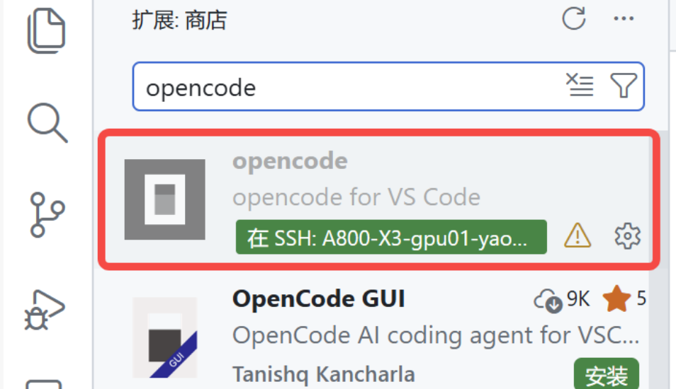

# OpenCode 教程

> OpenCode 安装、配置与使用指南。

## 安装

### 前置条件

- **Node.js** ≥ 18.0
- **包管理器**：npm / bun / pnpm / yarn 任选其一
- **Git**
- **API Key**：至少一个 LLM 提供商的 API 密钥

> 💡 **Windows 用户**：建议在 WSL 中使用。WSL 能避开 Windows 兼容性问题，且大多数开发工具优先支持 Linux。参见 [WSL 安装指南](../windows-wsl/windows-wsl.md)。

### 1. 安装 Node.js

**macOS / Linux (推荐 nvm)：**

```bash
# 安装 nvm
curl -o- https://raw.githubusercontent.com/nvm-sh/nvm/v0.40.1/install.sh | bash

# 重新加载 shell
source ~/.bashrc  # 或 ~/.zshrc

# 安装最新 LTS 版本
nvm install --lts
nvm use --lts
```

**Ubuntu/Debian (apt)：**

```bash
curl -fsSL https://deb.nodesource.com/setup_lts.x | sudo -E bash -
sudo apt install -y nodejs
```

**验证安装：**

```bash
node -v   # 应显示 v18.x.x 或更高
npm -v
```

### 2. 安装 Bun（可选但推荐）

Bun 是更快的 JavaScript 运行时和包管理器：

```bash
curl -fsSL https://bun.sh/install | bash
```

重新加载 shell 后验证：

```bash
bun -v
```

### 3. 安装 OpenCode

**方式一：官方脚本**

```bash
curl -fsSL https://opencode.ai/install | bash
```

**方式二：npm**

```bash
npm install -g opencode-ai
```

**方式三：bun（推荐）**

```bash
bun install -g opencode-ai
```

**方式四：Homebrew (macOS/Linux)**

```bash
brew install anomalyco/tap/opencode
```

### 4. 验证安装

```bash
opencode --version
```

### 5. 首次运行

在项目目录下执行：

```bash
opencode
```

正常情况应该可以加载出opencode初始界面，并且有opencode自带的免费模型。

---

### 常见问题

#### Windows 下兼容性问题

虽然 OpenCode 支持 Windows 原生运行，但可能遇到各种兼容性问题。推荐使用 WSL：

1. 安装 WSL：`wsl --install -d Ubuntu`
2. 在 WSL 中安装 Node.js 和 OpenCode

详见 [WSL 安装指南](../windows-wsl/windows-wsl.md)。

#### bun install 报错 symlink

在某些系统上需要确保 bun 全局目录在 PATH 中：

```bash
# 添加到 ~/.bashrc 或 ~/.zshrc
export BUN_INSTALL="$HOME/.bun"
export PATH="$BUN_INSTALL/bin:$PATH"
```

#### npm 权限错误

避免使用 sudo，改用 nvm 或配置 npm 前缀：

```bash
mkdir ~/.npm-global
npm config set prefix '~/.npm-global'
echo 'export PATH=~/.npm-global/bin:$PATH' >> ~/.bashrc
source ~/.bashrc
```

#### 命令未找到

确保全局安装目录在 PATH 中，重新加载 shell 配置：

```bash
source ~/.bashrc  # 或 source ~/.zshrc
```

#### 打开opencode的时候一直卡在开始界面，一直白屏

尝试禁用默认插件：

```bash
export OPENCODE_DISABLE_DEFAULT_PLUGINS=true
opencode
```

---

## 配置

### 1. 添加 API 密钥

OpenCode 支持 75+ 模型提供商。首次使用需要配置 API 密钥。

**方式一：交互式配置**

在 OpenCode TUI 中执行：

```
/connect
```

选择提供商，按提示完成认证。密钥存储在 `~/.local/share/opencode/auth.json`。

**方式二：命令行**

```bash
opencode auth login
```

这里可以搜索官方支持的provider，然后按照要求提供auth或者api key。

能够直接通过auth login添加的，常见的有github-copilot（使用学生认证可以有挺多额度，直接接入opencode来使用）；openai的codex；智谱的coding plan或者api。

能够直接使用的还有google的gemini-cli的额度，如果使用插件antigravity-auth可以把antigravity的额度拿出来在opencode中使用。对于gemini的模型，这里需要注意的是：

- antigravity-auth有封号的风险（虽然我也使用过一段时间，没被封，但是确实不稳定，特别使用antigravity中的claude额度更是容易刷新频率被限制）；
- gemini-cli额度（也就是直接auth login登录得到的那个gemini使用额度）是免费的，每天刷新，但是你传输给google的数据有被拿来训练的风险。所以敏感数据不要用这个。
- 直接使用google的模型都需要连接vpn才行，如果在服务器上使用，需要进行端口映射。antigravity的使用参考：[飞书文档](https://my.feishu.cn/wiki/NSMiwydefiQuAPkozzOcjRySnxc?from=from_copylink)

如果你想要你的agent能够在服务器上无人值守长时间运行，几乎是不可能采用本地vpn+端口映射的方式的。而如果在内部服务器上安装vpn，则是非常危险的，容易被查水表。所以剩下的，在大陆比较好用的，有两个选择：一个是使用开在大陆的中转站（算是灰色地带），另一个是直接使用国产大模型的api。

关于中转站，有一个叫 [relaypulse](https://relaypulse.top/) 的网站提供挺多中转站的可用性监控。可以用作参考，目前我使用过的是一个叫 SSSAiCode 的中转站。可以通过这个[链接](https://www.sssaicode.com/register?ref=JVEWJB)注册。试用可以买9.9一个月20刀的那个套餐。claude和codex可以在这个里面用，支持最新的4.6和codex。配置的时候，打开安装说明，选择opencode，生成你自己的key（opencode只能用AWS逆向，因为官方api会检测opencode然后封号，现在已经没有了）。选个延迟低的服务器节点，选择操作系统，然后可以看到给出的配置文件，将这个配置文件中的provider中你需要的provider复制到你的 `~/.config/opencode/opencode.json` 中。比如你只需要claude，那就复制anthoropic的那个部分，如果需要codex，那就复制openai的部分。

关于国产大模型，比如智谱的GLM，是可以直接在opencode中认证的，复制购买了套餐的api填入到auth就可以了。

### 2. 配置文件

**位置**（优先级从低到高）：

1. `~/.config/opencode/opencode.json` — 全局配置
2. 项目目录 `opencode.json` — 项目配置

**示例配置**：

```json
{
  "$schema": "https://opencode.ai/config.json",
  "plugin": [
    "oh-my-opencode",
  ],
  "provider": {
    ...
  }
}
```

---

### 推荐插件：oh-my-opencode

[oh-my-opencode](https://github.com/code-yeongyu/oh-my-opencode) 是一个功能增强插件，提供：

- Sisyphus 智能代理（规划、执行、验证）
- Context7 MCP（实时获取库文档）
- grep.app MCP（跨 GitHub 仓库搜索）
- 更多专用工具和 MCP

  有了omo，基本上才解锁了opencode的多智能体潜力

#### 安装

已经是agent时代了，opencode有默认免费的大模型可以使用。你完全可以登录进去之后让它自己安装插件，只要告诉它下面的内容，然后根据自己的情况选择就可以了。

```plaintext
Install and configure oh-my-opencode by following the instructions here:
https://raw.githubusercontent.com/code-yeongyu/oh-my-opencode/refs/heads/master/docs/guide/installation.md
```

在安装了omo后，会成一个 ~/.config/opencode/oh-my-opencode.jsonc 的文件（可以是json也可以是jsonc，它们唯一的区别是jsonc里面可以用 // 写注释）

你应该根据自己的需要配置模型，模型需要通过id进行指定，你可以在命令行中通过 opencode models 显示所有可用的模型id。

下面有一个我使用的通用配置，里面使用的是GLM-5和copilot的claude结合

```json
{
  "$schema": "https://raw.githubusercontent.com/code-yeongyu/oh-my-opencode/master/assets/oh-my-opencode.schema.json",
  "agents": {
    "sisyphus": {
      "model": "zhipuai-coding-plan/glm-5",
      "variant": "max"
    },
    "hephaestus": {
      "model": "zhipuai-coding-plan/glm-5",
      "variant": "medium"
    },
    "oracle": {
      "model": "github-copilot/claude-opus-4.6",
      "variant": "high"
    },
    "librarian": {
      "model": "zhipuai-coding-plan/glm-4.7"
    },
    "explore": {
      "model": "zhipuai-coding-plan/glm-4.7"
    },
    "multimodal-looker": {
      "model": "zhipuai-coding-plan/glm-4.6v"
    },
    "prometheus": {
      "model": "github-copilot/claude-opus-4.6",
      "variant": "max"
    },
    "metis": {
      "model": "github-copilot/claude-opus-4.6",
      "variant": "max"
    },
    "momus": {
      "model": "github-copilot/claude-opus-4.6",
      "variant": "medium"
    },
    "atlas": {
      "model": "zhipuai-coding-plan/glm-4.7"
    }
  },
  "categories": {
    "visual-engineering": {
      "model": "github-copilot/claude-sonnet-4.5"
    },
    "ultrabrain": {
      "model": "github-copilot/claude-opus-4.6",
      "variant": "high"
    },
    "deep": {
      "model": "openai/gpt-5.3-codex",
      "variant": "medium"
    },
    "artistry": {
      "model": "github-copilot/claude-opus-4.6",
      "variant": "high"
    },
    "quick": {
      "model": "zhipuai-coding-plan/glm-4.7"
    },
    "unspecified-low": {
      "model": "zhipuai-coding-plan/glm-4.7"
    },
    "unspecified-high": {
      "model": "zhipuai-coding-plan/glm-5"
    },
    "writing": {
      "model": "zhipuai-coding-plan/glm-4.7"
    }
  }
}

```

这里还有一个可以写paper可以参考的配置，使用antigravity+copilot

```json
{
  "$schema": "https://raw.githubusercontent.com/code-yeongyu/oh-my-opencode/master/assets/oh-my-opencode.schema.json",
  "google_auth": false,
  "agents": {
    "Sisyphus": {
      "model": "google/antigravity-claude-sonnet-4-5-thinking",
      "variant": "low",
      "prompt_append": "You are in ACADEMIC PAPER WRITING mode.\n\nPriorities:\n1. Formal academic language with precise terminology\n2. Logical argument structure with clear transitions\n3. Proper BibTeX citations\n4. Standard paper structure\n5. Clarity and conciseness over wordiness"
    },
    "oracle": {
      // Sisyphus 遇到难题时自动咨询，频率相对较高
      "model": "github-copilot/claude-opus-4.6",
    },
    "librarian": {
      // 长上下文处理大量文献
      "model": "google/antigravity-gemini-3-pro",
      "variant": "high",
    },
    "explore": {
      "model": "google/antigravity-gemini-3-flash"
    },
    "multimodal-looker": {
      // 分析论文图表时需要一点推理
      "model": "google/antigravity-gemini-3-flash",
      "variant": "low"  // ← 可选
    },
    "prometheus": {
      // 规划用 max thinking
      "model": "github-copilot/claude-sonnet-4.5",
      "variant": "high"
    },
    "atlas": {
      // Gemini 3 Pro 长上下文适合长任务，轻度 thinking
      "model": "google/antigravity-gemini-3-pro",
      "variant": "low" 
    },
    "document-writer": {
      // 学术写作 Claude 比 Gemini 强
      "model": "google/antigravity-gemini-3-flash",  // sonnet用的地方太多了，这里换成gemini flash 节省token
    }
  },
  "categories": {
    "deep-thinking": {
      // delegate_task 的深度思考任务
      "model": "github-copilot/claude-sonnet-4.5",
      "variant": "high",
      "temperature": 0.2,
      "prompt_append": "Engage in rigorous analytical thinking. Focus on logic, methodology, and argumentation."
    },
    "writing": {
      // 写作润色任务
      "model": "github-copilot/claude-sonnet-4.5",
      "temperature": 0.6,
      "prompt_append": "Polish for academic excellence: clarity, precision, scholarly tone."
    },
    "ultrabrain": {
      // 核武器：极端复杂问题，显式调用，全力输出
      "model": "github-copilot/claude-opus-4.6",
      "variant": "thinking"
    },
    "quick": {
      // 快速简单任务
      "model": "google/antigravity-gemini-3-flash",
      "temperature": 0.5
    }
  }
}
```

---

### 配置切换工具：omo-switch

[omo-switch](https://github.com/Aykahshi/omo-switch) 用于在不同 oh-my-opencode 配置之间快速切换。

#### 安装

```bash
npm install -g omo-switch-cli
# 别名：omos
```

#### 使用

```bash
# 初始化
omo-switch init

# 导入配置
omo-switch add ./my-config.jsonc --name "work"

# 查看配置列表
omo-switch list

# 切换配置
omo-switch apply work
```

比如你上面有两套oh-my-opencode配置，想要写paper的时候用一套，做模型的时候用一套，研究因子的时候用一套。可以用这个进行管理，提前预设好，使用的时候通过 omo-switch apply 来使用就行了。你通过 omo-switch add 添加的配置会在 ~/.config/omo-switch/configs下，要快速创建配置，你也可以直接在这个文件夹下面创建配置，用的时候apply那个文件名就好。

### 4. VSCode 插件

OpenCode 提供官方 VSCode 扩展，可在编辑器内直接使用。

**安装**：在 VSCode 扩展市场搜索 "OpenCode" 安装。



**功能**：

- 侧边栏对话窗口
- 代码内联建议
- 快捷键支持

安装好后，在vscode的标签页右侧会出现个这个黑色标记，点击可以在右边开一个新的opencode内联页面。

这种内联页面内，在项目内的文件选中文段后，可以通过 ctrl+alt+k，将文段行号发送给opencode，便于精准编辑。opencode中也可以直接通过@来指定文件。

---

## 基本使用

### 1. 选择模型

打开 OpenCode 后：

```
/models
```

或使用快捷键 `Ctrl+X M`，查看可用模型并选择。

### 2. 会话管理

查看历史会话、新建会话、删除会话：

```
/sessions
```

或使用快捷键 `Ctrl+X L`。

### 3. 设置编辑器

OpenCode 的输入框有时不太方便，粘贴内容可能显示为 "1lines"。可以设置外部编辑器：

```bash
# 设置默认编辑器
export EDITOR=vim   # 或 code、nano
```

需要精细编辑时，按 `Ctrl+X E` 打开外部编辑器编辑 prompt。

### 4. 初始化项目

在 OpenCode 中打开新项目时，建议先初始化 AGENTS.md 文件，让 AI 了解项目结构和约定：

```
/init          # 快速初始化，生成根目录 AGENTS.md
/init-deep     # 深度初始化，为复杂目录生成层级 AGENTS.md
```

**AGENTS.md 是什么？**

AGENTS.md 是项目的"知识库"，告诉 AI：
- 项目结构和各目录用途
- 代码风格和命名约定
- 构建、测试、启动命令
- 常见陷阱和反模式

**初始化后，AI 会：**
- 更准确地理解代码上下文
- 遵循项目现有的代码风格
- 知道去哪里找相关文件
- 避免触犯项目特有的禁忌

**推荐做法**：大型项目用 `/init-deep`，小型项目用 `/init`。初始化后可以手动微调生成的内容。

### 5. 关于 compact

当对话历史过长时，OpenCode 会自动或手动压缩上下文。

**自动压缩**

当 token 使用量接近上下文窗口上限（通常 95%）时，OpenCode 会自动触发压缩：
- 生成对话摘要作为新上下文
- 保留关键信息，丢弃冗余内容
- 继续当前任务不会中断

**手动压缩**

```
/compact
```

在对话过长时主动触发，避免等待自动压缩。

**与 `/clear` 的区别**

| 命令 | 效果 |
|------|------|
| `/compact` | 保留摘要，延续任务 |
| `/clear` | 清空所有历史，重新开始 |

**注意事项**：多次连续压缩可能导致信息累积丢失。如果 AI 似乎"忘记"了早期对话内容，考虑用 `/clear` 重新开始，或手动补充关键背景信息。


## 常见问题

### 启动时卡在白屏

尝试禁用默认插件：

```bash
export OPENCODE_DISABLE_DEFAULT_PLUGINS=true
opencode
```

### 配置不生效

配置优先级：项目配置 > 全局配置。检查是否存在冲突的项目级 `opencode.json`。

## 进阶技巧

### 语音输入（豆包）

在电脑上安装豆包 App，使用语音输入功能。适合长篇需求描述。之所以推荐豆包而不是讯飞，是因为豆包会根据你的意图调整文字。讯飞择时忠实于原文。豆包安装后可以给语音输入功能添加快捷键，比如我是设置为了 alt+s。

**推荐场景**：

- 复杂需求说明
- 多步骤任务规划
- 快速记录灵感

### 多会话并行

OpenCode 支持多会话管理：

- `Ctrl+X L` 打开会话列表
- 可同时运行多个独立任务
- 每个会话保持独立上下文

---

## 相关资源

- [OpenCode 官方文档](https://opencode.ai/docs)
- [oh-my-opencode GitHub](https://github.com/code-yeongyu/oh-my-opencode)
- [omo-switch GitHub](https://github.com/Aykahshi/omo-switch)
- [OpenCode Discord 社区](https://discord.gg/opencode)
- [中转站可用性监控](https://relaypulse.top/)
