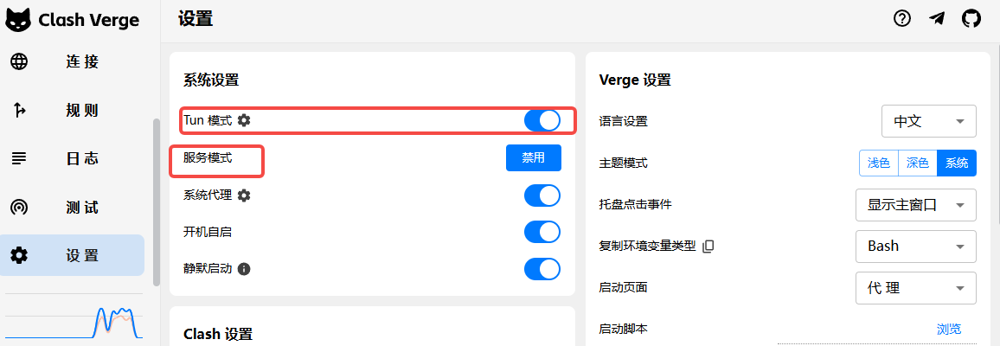

# 关于撰写论文的大模型与智能体经验技巧

论文撰写已进入 **Vibe Paper** 的新时代。传统的"孤独写作"模式正在被 AI 辅助的"对话式创作"所取代——你可以与智能体讨论思路、迭代内容、优化表达，整个写作过程变得更加自然流畅。

## Vibe Paper 的核心要素

Vibe Paper 的核心包含三个关键组成部分：

```
Vibe Paper = LaTeX Env + Agent Framework (LLM Model) + Context
```

想要让 Agent 协助撰写论文，进入 Vibe Paper 的状态，最重要的是：
1. **搭建好本地 LaTeX 编译环境** —— 让 AI 能直接编译预览
2. **选择合适的模型和 Agent 框架** —— 决定了 AI 的能力和交互体验
3. **提供精确的上下文** —— 让 AI 真正理解你的研究内容

下面我们逐一展开。

---

## 一、LaTeX 环境

### 1.1 为什么需要本地 LaTeX 环境？

传统论文编写通常使用 **Overleaf** 这类在线 LaTeX 编辑工具。这类工具虽然方便，但存在一个关键问题：**无法方便地提供完整的项目上下文给 AI**。

在线工具的局限性：
- 只能使用平台内嵌的 AI 功能，无法自由选择模型
- 难以让 AI 访问项目的全部文件（代码、数据、图片等）
- 无法定制 AI 的工作流程和行为

**本地 LaTeX 环境的优势**：
- 可以直接将项目相关内容（论文、代码、数据、参考文献）放在同一文件夹中
- 大模型可以自动读取所有相关文件，获得完整的上下文
- 编译速度快，响应及时
- 完全掌控自己的工作环境

### 1.2 LaTeX 环境搭建指南

关于 LaTeX 环境搭建，推荐参考以下文档。虽然标题写了 Antigravity，但配置完全兼容 VS Code。实际上，如果你只使用 VS Code 而不使用 Antigravity，配置方式也完全一样。

**参考文档**：[Antigravity + LaTeX (WSL方案) 终极配置指南](https://my.feishu.cn/wiki/AECHwFFRBixbuQkNrlZc9bbCn9e)

这份教程的主要内容包括：

1. **为什么要选择 WSL + LaTeX 方案**：介绍了轻量化、零 Bug 环境、极速编译三大优势
2. **安装 WSL 和 Ubuntu**：如何在 Windows 上安装 Linux 子系统
3. **安装精简版 TeXLive**：按需安装覆盖 99% 论文需求的必要组件，以及缺少宏包时的解决方法
4. **项目存放位置注意事项**：避免跨文件系统读写导致的性能问题

具体安装步骤请参考原文档。

---

## 二、Agent 框架选型

### 2.1 常见框架对比

关于智能体框架的选型，目前比较常见的方案有：

| 框架 | 类型 | 特点 |
|------|------|------|
| VS Code + Copilot 插件 | 插件式 | 微软官方，支持多模型 |
| VS Code + Claude Code + Claude for VS Code | CLI + 插件 | 灵活可控，支持自定义 Skill |
| VS Code + OpenCode + VS Code OpenCode 插件 | CLI + 插件 | 开源方案，可接入自部署模型 |
| Antigravity | 独立 IDE | Google 出品，开箱即用 |
| Cursor | 独立 IDE | 老牌智能体 IDE，功能成熟 |

前三种方案的核心 IDE 都是 VS Code，使用起来更加灵活；Antigravity 是 Google 自己推出的智能体 IDE；Cursor 则是老牌的智能体 IDE。

### 2.2 各框架详细说明

#### GitHub Copilot

- **付费方式**：需要购买 GitHub Copilot 服务，学生可申请教育试用（每次认证可试用 1-2 年）
- **模型支持**：Codex、Claude、Gemini 等多种模型
- **获取途径**：官方网站订阅，或通过第三方渠道（如咸鱼）购买账号

#### Antigravity

- **付费方式**：只要有 Gemini Pro 版本的账号就可以使用
- **账号要求**：需要账号所在地支持 Antigravity，如果所在地不对需要修改（审核时间 1-3 天）
- **额度机制**：每 5 小时有一定使用额度，每周也有一定额度
- **注意事项**：如果频繁耗尽额度，会触发额度锁，5 小时的恢复时间会变成 3-5 天
- **下载地址**：https://antigravity.google/
- **获取途径**：咸鱼上可购买账号，但建议买老号，新号容易被封禁
  
关于antigravity有一些补充说明见本章最后附录。

#### Cursor

- **付费方式**：需要购买 Cursor 自己的服务，每月一定限额
- **模型支持**：Codex、Claude、Gemini 等多种模型
- **获取途径**：同样可以在咸鱼上购买

#### Claude Code 和 OpenCode

这两个框架比较特殊，它们本质上是 **命令行框架**：
- 可以不绑定某家公司，自由选择各家企业的 API
- 甚至可以接入自己部署的大模型
- 加上 VS Code 插件后，也能拥有完整的 IDE 编程体验

详细安装参考：
- [OpenCode 安装教程](../opencode/index.md)
- [Claude Code 安装教程](../claudecode/index.md)

### 2.3 选型建议

从使用体验上来说，上面几种框架差异不大。选择建议如下：

**如果你想省事，不想折腾**：
- 使用 **Antigravity**
- 上手门槛低，自带搜索和浏览器操作
- Gemini 的多模态能力足够强
- 需要有可以打开 TUN 模式的 VPN
- 缺点：Gemini 模型的指令遵循稍差，需要给出严格完整的命令
- 好处：在创新创作上，Gemini 3 Pro 的使用体验比 Claude 更好

**如果你愿意折腾，想使用开源 Skill**：
- 建议使用 **Claude Code**
- 网上有很多可复用的 Skill 资源
- 对 Skill 的支持更好

关于 OpenCode 的说明：目前使用下来，带上 Skill 后的上下文会比较混乱，反而影响了模型效果。不确定是模型原因还是 OpenCode 本身的问题。

### 2.4 Skill 资源推荐

Skill 是非常重要的插件，可以将别人的重要经验复用：

**AI 论文写作相关资源**：
- 绘图 Prompt：https://github.com/Leey21/awesome-ai-research-writing
- AI 研究 Skill：https://github.com/Orchestra-Research/AI-Research-SKILLs

> 目前我自己使用这些 Skill 还没发挥出很好的效果，可能是框架选择的问题。有待探索使用 Claude Code 是否可以获得更好的 Skill 兼容性。

---

## 三、上下文（Context）构建

### 3.1 上下文的重要性

实测下来，**不管使用哪种框架，最重要的还是上下文的构建与经验的归纳**。

上下文决定了 AI 能理解多少你的研究内容，能提供多高质量的帮助。一个好的上下文构建策略，比选择哪个模型或框架更加关键。

### 3.2 上下文构建策略

不管使用哪种框架，建议遵循以下原则：

**1. 尽可能多地提供材料**

将以下内容都放到文档空间中：
- 研究代码和运行结果
- 口头上的思路描述
- 实验数据和图表
- 参考文献和笔记

**2. 让 AI 自动整理**

让大模型自己总结到一个文档中，形成结构化的知识库。

**3. 建立回顾机制**

在 Rule（规则）中要求大模型：
- 每次撰写相关部分时，先回顾总结文档
- 保持内容的连贯性和一致性
- 避免重复或矛盾

### 3.3 实践建议

一个典型的项目结构可以是：

```
my_paper/
├── main.tex              # 论文主文件
├── sections/             # 各章节
├── figures/              # 图片资源
├── references.bib        # 参考文献
├── code/                 # 实验代码
├── results/              # 实验结果
├── .agent_workspace      # agent的经验、知识、note等。可以参考opencode部分的workspace进行设计
└── README.md             # 项目说明
```

---

## 四、总结

进入 Vibe Paper 时代，论文写作的范式正在改变。要充分利用 AI 辅助写作，记住三个关键：

1. **环境先行**：搭建好本地 LaTeX 环境，让 AI 能自由访问项目文件
2. **框架适配**：根据自己的需求和折腾意愿选择合适的 Agent 框架
3. **上下文为王**：精心构建和维护项目的上下文，这是 AI 提供高质量帮助的基础


## 附录

### antigravity中的一些坑

本地使用antigravity需要打开服务模式和TUN模式，才能代理应用。



如果还有问题的话，可以确定下是不是账号所属地的问题，可以在这个里面查看和更改所属地，https://policies.google.com/country-association-form，如果地址不在gemini提供支持地的话，需要提交表格更改所属地，原因选择在领土边界和分属不同地区就行，避免选择经常使用VPN。申请后大概等一个工作日再登录。