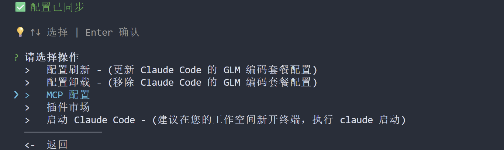
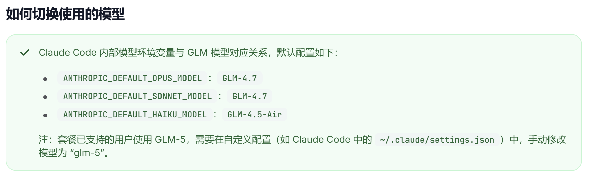
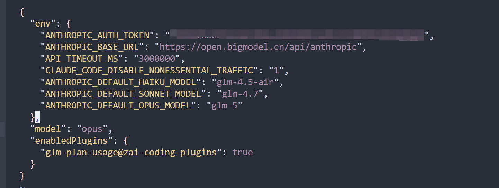
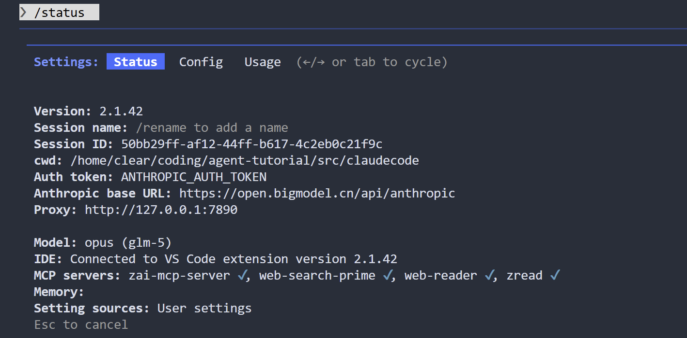

# Claude Code 安装与配置

Claude Code 是 Anthropic 官方推出的 AI 编程助手命令行工具，支持代码生成、文件操作、命令执行等功能。本节介绍如何通过智谱 GLM Coding Plan 使用 Claude Code。未来可能会补充其它供应商下的claude code使用。

## 前置条件

- **Node.js** >= v18.0.0（安装方式参见 [OpenCode](../opencode/index.md) 一节）
- 智谱 GLM Coding Plan 套餐订阅

## 安装 Claude Code

```bash
npm install -g @anthropic-ai/claude-code
```

## 配置智谱 GLM 接入

如果你订阅了 GLM Coding Plan，可以通过智谱的配置助手完成接入。

### 使用配置助手

运行以下命令启动配置助手：

```bash
npx @z_ai/coding-helper
```

首次使用时：
1. 设置语言偏好
2. 配置 API Key
3. 选择编码工具 —— 选择 **Claude Code**
4. 选择 **配置装载**，系统会自动将 GLM 配置到 Claude Code

### 可选配置项

配置助手提供两个推荐的附加配置：



- **MCP 配置**：安装视觉理解等扩展能力，详见 [MCP 配置](../mcp-zhipu/index.md)
- **插件市场**：安装 `glm-plan-usage` 插件，用于查询套餐限额

建议两个都安装，完成后选择退出。

> **参考资料**：[智谱 Claude Code 接入指南](https://docs.bigmodel.cn/cn/coding-plan/tool/claude)

## 切换模型

### 默认模型映射

智谱对 Claude Code 中的模型进行了映射，默认配置如下：

| Claude 模型 | 映射的 GLM 模型 |
|------------|----------------|
| Opus | GLM-4.7 |
| Sonnet | GLM-4.7 |
| Haiku | GLM-4.5-Air |

即使使用 `/status` 命令，你看到的模型显示仍然是 Opus/Sonnet/Haiku，但实际调用的是对应的 GLM 模型。



### 启用 GLM-5

GLM-5 不是默认配置的模型。如果你需要使用 GLM-5，需要手动修改配置文件。

编辑 `~/.claude/settings.json`，在 `env` 对象中添加以下字段（注意保留已有配置）：

```json
{
  "env": {
    "ANTHROPIC_DEFAULT_HAIKU_MODEL": "glm-4.5-air",
    "ANTHROPIC_DEFAULT_SONNET_MODEL": "glm-4.7",
    "ANTHROPIC_DEFAULT_OPUS_MODEL": "glm-5"
  }
}
```

配置完成后，文件内容应类似下图：



使用 `/status` 命令验证，应能看到 GLM-5 的标识：



### 模型切换命令

使用 `/model` 命令切换模型：

- 选择 `opus` 即使用 GLM-5
- 选择 `sonnet` 即使用 GLM-4.7
- 选择 `haiku` 即使用 GLM-4.5-Air

> **注意**：Claude Code 原生有 `opus(1M)` 选项，但 GLM 没有 1M 上下文版本。虽然可以选择并正常对话，但超过 200k 上下文时可能出现问题。使用 GLM-5 时请选择基础版本的 `opus`。

## 长时间运行配置

如果你需要通过 SSH 连接长时间运行 Claude Code，推荐使用 tmux 会话管理工具。

### 安装 tmux

```bash
# Ubuntu/Debian
sudo apt install tmux

# macOS
brew install tmux
```

### 启用鼠标模式

编辑 tmux 配置文件：

```bash
vim ~/.tmux.conf
```

添加以下内容：

```bash
set -g mouse on
```

这样可以在 tmux 会话中使用鼠标滚轮和点击切换窗格。

## 常见问题

### 如何查看当前配置和连接状态？

使用 `/status` 命令查看版本、模型、MCP 服务器连接状态等信息。

### 如何查看套餐用量？

如果安装了 `glm-plan-usage` 插件，可以使用 `/glm-plan-usage:usage-query` 命令查询当前套餐的额度消耗情况。

## 相关资源

- [Claude Code 官方文档](https://docs.anthropic.com/en/docs/claude-code)
- [智谱 GLM Coding Plan 概览](https://docs.bigmodel.cn/cn/coding-plan/overview)
- [智谱 Claude Code 接入指南](https://docs.bigmodel.cn/cn/coding-plan/tool/claude)
