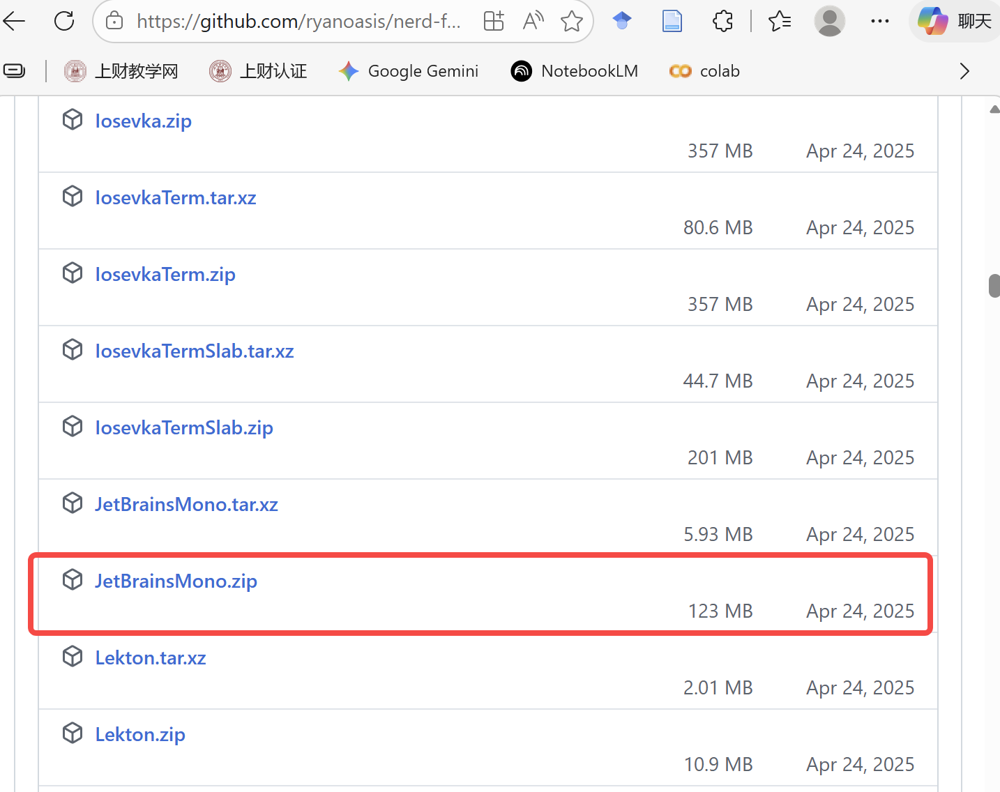

# 终端环境配置

使用 WezTerm 等现代终端连接远程服务器时的常用配置：Nerd Fonts 图标字体、远程服务器上的 yazi、tmux 鼠标与复制设置。

## 安装 Nerd Fonts（支持图标渲染）

yazi 等工具会用图标显示文件类型，需要终端字体支持。目前最流行的是 [Nerd Fonts](https://github.com/ryanoasis/nerd-fonts/releases)，安装非常简单：

1. **下载字体包**：直接下载官方打包好的 [JetBrainsMono.zip](https://github.com/ryanoasis/nerd-fonts/releases/latest/download/JetBrainsMono.zip)

   

2. **解压文件**：解压 zip 包，会看到一堆以 `.ttf` 结尾的字体文件。

3. **一键安装到 Windows**：
   - 打开解压后的文件夹
   - **全选**（`Ctrl + A`）里面所有的 `.ttf` 文件
   - **右键点击**，选择 **"安装"**（或者"为所有用户安装"）
   - 等待几秒钟，Windows 进度条跑完就装好了

安装后记得在终端设置里把字体切换为 `JetBrainsMono Nerd Font`。

## 在远程服务器上使用 yazi 快速查看文件

```sh
# 1. 下载最新版 yazi 的预编译压缩包
wget https://github.com/sxyazi/yazi/releases/latest/download/yazi-x86_64-unknown-linux-gnu.zip

# 2. 解压压缩包
unzip yazi-x86_64-unknown-linux-gnu.zip

# 3. 确保用户目录下有存放自定义可执行文件的 bin 目录
mkdir -p ~/.local/bin

# 4. 将 yazi 核心程序移动到该目录
cp yazi-x86_64-unknown-linux-gnu/yazi ~/.local/bin/
cp yazi-x86_64-unknown-linux-gnu/ya ~/.local/bin/

# 5. 赋予运行权限
chmod +x ~/.local/bin/yazi ~/.local/bin/ya

# 6. 清理安装包
rm -rf yazi-x86_64-unknown-linux-gnu.zip yazi-x86_64-unknown-linux-gnu/
```

yazi 的详细介绍和扩展依赖见 [终端工具推荐](../terminal-tool/index.md)。

## tmux 鼠标与复制配置

编辑 `~/.tmux.conf`：

```sh
# 开启鼠标支持（可选，方便拖拽复制）
set -g mouse on

# 开启 vim 格式
setw -g mode-keys vi

# 允许 tmux 将序列传递给外部终端
set -s set-clipboard on

# 如果你使用的是 tmux 3.2 或更高版本，建议设置以下项以增强兼容性
set -as terminal-features ',xterm-256color:clipboard'
```

使用 Claude Code 时经常想复制很长一段跨页的内容，可以通过 tmux 内置的复制模式做到：

1. 上划滚轮进入历史模式（或者按 `Ctrl+B` 再按 `[`）
2. 找到想要的内容起点，按一下**空格**进入选择模式
3. 一直选择到目标位置，按**回车**复制到剪贴板

配置生效后，复制的内容可以直接传输到本地电脑的剪贴板中。
